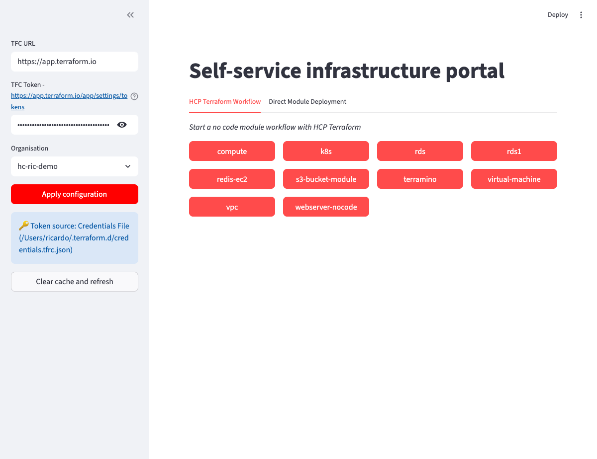
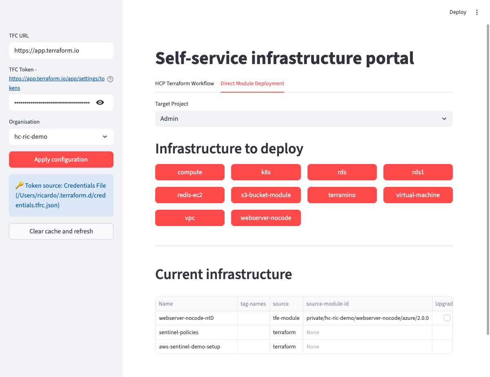
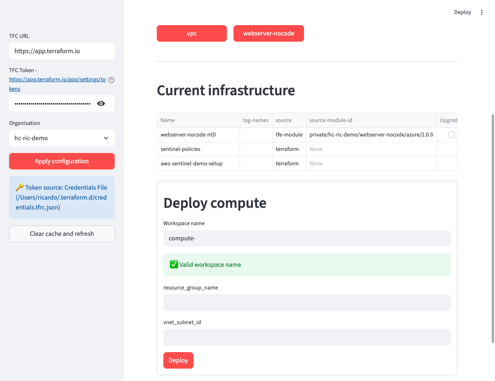

# No-code deployment application with HCP Terraform

[](https://opensource.org/licenses/MIT)
[](https://www.python.org/downloads/)
[](https://github.com/astral-sh/ruff)
[](http://mypy-lang.org/)

## Overview

This is a no-code deployment application that leverages HCP Terraform to automate the provisioning and management of infrastructure resources. With this application, you can deploy and manage your infrastructure without writing any code.

The application provides a user-friendly Streamlit interface that wraps the Terraform Cloud API (`terrasnek` library) to enable infrastructure deployment without direct HCP Terraform UI interaction.

## Features

- **No-code deployment**: Deploy infrastructure resources through an intuitive web interface
- **HCP Terraform integration**: Automatic token discovery from multiple sources (environment variables, credentials file)
- **Dynamic form generation**: Variable inputs auto-generated based on module requirements
- **Workspace management**: View and manage existing workspaces by project
- **Input validation**: Workspace names and variable values validated before deployment
- **Multi-project support**: Deploy to different projects within your organization
- **Settings persistence**: URL parameters preserve configuration across page refreshes

## Screenshots

### Application interface

The portal provides an intuitive interface for deploying no-code modules:


*Sidebar configuration showing automatic token discovery and organization selection*

### Direct module deployment

Select from available no-code modules and deploy infrastructure with a few clicks:


*Browse available no-code modules in the direct module deployment tab*

### Deployment form

Dynamic forms with some basic API validation ensure correct inputs before deployment:


*Deployment form with workspace name validation and variable inputs*

## Prerequisites

Before using this application, ensure you have:

### HCP Terraform requirements
- **Organization**: An HCP Terraform organization
- **Token**: API token with appropriate permissions
- **No-code modules**: At least one registry module marked as no-code

### Local requirements
- **Python**: 3.11 or higher
- **pip**: Package installer for Python
- **Git**: Version control

## Installation

### Quick start

1. **Clone the repository**:
   ```bash
   git clone https://github.com/gitrgoliveira/tfc-no-code-portal.git
   cd tfc-no-code-portal
   ```

2. **Run the application**:
   ```bash
   make run
   ```
   Or alternatively:
   ```bash
   ./run_portal.sh
   ```

3. **Access the application**:
   The application automatically opens in your browser at `http://localhost:8501`

### Development installation

For development with testing and linting tools:

```bash
make install-dev
```

This installs all dependencies and sets up pre-commit hooks.

## Usage

### Authentication

The application automatically discovers your HCP Terraform token from multiple sources (in priority order):

1. **Environment variable**: `TF_TOKEN_{hostname}` (e.g., `TF_TOKEN_app_terraform_io`)
2. **Credentials file**: `~/.terraform.d/credentials.tfrc.json`
3. **Legacy environment variable**: `TFC_TOKEN`

Alternatively, you can manually enter your token in the UI.

### Basic workflow

1. **Configure settings** (Sidebar):
   - Enter HCP Terraform URL (defaults to https://app.terraform.io)
   - Token is auto-discovered or enter manually
   - Select your organization
   - Click "Apply configuration"
   
   Refer to the [application interface screenshot](#application-interface) for the configured sidebar.

2. **Deploy infrastructure**:
   - Choose the "Direct module deployment" tab
   - Select target project
   - Click a module to deploy
   - Enter workspace name and required variables
   - Click "Deploy"
   
   Refer to the [direct module deployment](#direct-module-deployment) and [deployment form](#deployment-form) screenshots.

3. **View workspaces**:
   - Current infrastructure is displayed by project
   - Click workspace links to open in HCP Terraform

## Development

### Available commands

```bash
make help            # Show all available commands
make run             # Run the application
make test            # Run tests with coverage
make lint            # Run code linter
make format          # Format code
make type-check      # Run type checker
make verify          # Run all quality checks
make clean           # Clean up generated files
```

### Running tests

```bash
make test            # Full test suite with coverage
make test-quick      # Quick tests without coverage
```

View coverage report: `open htmlcov/index.html`

### Code quality

The project uses:
- **ruff**: Fast Python linter and formatter
- **mypy**: Static type checker
- **pytest**: Testing framework
- **pre-commit**: Git hooks for quality checks

Run all quality checks:
```bash
make verify
```

### Project structure

```
.
├── constants.py          # Application constants
├── portal.py            # Main Streamlit application
├── no_code.py           # Payload generator for deployments
├── validation.py        # Input validation utilities
├── utils.py             # Shared utility functions
├── tests/               # Test suite
├── pyproject.toml       # Tool configuration
├── requirements.in      # Direct dependencies
├── requirements.txt     # Pinned dependencies
└── Makefile            # Development commands
```

Refer to [CONTRIBUTING.md](CONTRIBUTING.md) for detailed development guidelines.

## Troubleshooting

### Token not found

```bash
# Set token environment variable
export TF_TOKEN_app_terraform_io="your-token-here"

# OR use Terraform CLI
terraform login
```

### Connection errors

- Verify HCP Terraform URL is correct
- Check network connectivity
- Ensure token has required permissions

### Module not appearing

- Ensure module is marked as "no-code" in registry
- Verify you have access to the module's organization
- Refresh the module list with "Clear cache and refresh"

## Contributing

Contributions are welcome! Refer to [CONTRIBUTING.md](CONTRIBUTING.md) for:
- Development setup instructions
- Code style guidelines
- Testing requirements
- Pull request process

## Documentation

- **[AGENTS.md](AGENTS.md)**: Detailed architectural documentation
- **[CONTRIBUTING.md](CONTRIBUTING.md)**: Development and contribution guidelines
- **[.github/copilot-instructions.md](.github/copilot-instructions.md)**: AI agent instructions

## License

This project is licensed under the MIT License. Refer to the [LICENSE.md](LICENSE.md) file for details.

## Support

- **Issues**: [GitHub Issues](https://github.com/gitrgoliveira/tfc-no-code-portal/issues)
- **Discussions**: [GitHub Discussions](https://github.com/gitrgoliveira/tfc-no-code-portal/discussions)

